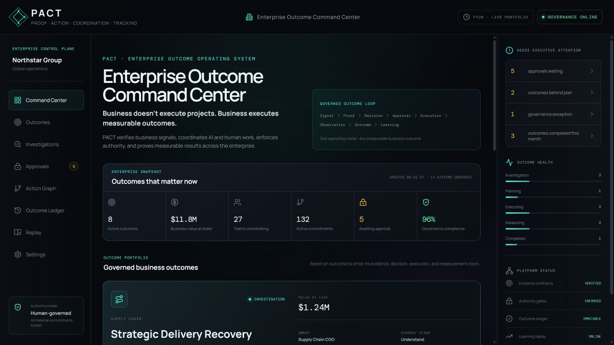
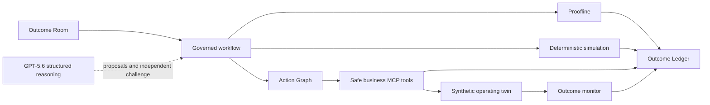

<div align="center">

# PACT

### Proof · Action · Coordination · Tracking

**The enterprise operating system for measurable outcomes.**

</div>



PACT is an Enterprise Outcome Command Center for COO, transformation, and functional leaders. Its opening control plane shows the outcomes that matter across the organization; each Outcome Room then governs the complete path from business signal to proof, decision, human approval, coordinated execution, measured result, and organizational learning.

Strategic Delivery Recovery is the fully implemented flagship outcome—not the product boundary. The same portfolio architecture is designed for cost optimization, throughput, customer retention, working capital, compliance, safety, and other measurable enterprise results.

The flagship case begins with a decision any executive can understand: **$1.24M in revenue, 42 strategic customers, and 318 orders are at risk. Can five teams recover delivery performance to at least 82% within 21 days and a $75K budget?**

> AI should not merely produce business answers. It should earn the right for those answers to influence real decisions.

## The flagship outcome

An organization sees On Time In Full (OTIF) fall from **84.3% to 72.4%**. Existing dashboards can report the decline. PACT answers the harder sequence:

1. Is the signal trustworthy?
2. What operational evidence explains it?
3. Which customers, money, and teams are exposed?
4. Which recovery strategy respects the business constraints?
5. What must happen across procurement, manufacturing, logistics, finance, and customer teams?
6. Who has authority to approve the response?
7. Did the approved actions produce the intended outcome?

The deterministic demonstration closes at **82.1% observed synthetic OTIF on Day 21**, compared with a **82.2% simulated projection** and a target of **82.0%**.

The experience is organized around three leadership phases:

```text
UNDERSTAND — trust the signal → DECIDE & MOBILIZE — move the organization → PROVE — measure the result
```

The initial value case compares **$1.24M of exposure** with a **$68,750 bounded response**—an 18.0× exposure-to-cost ratio. This is explicitly not presented as ROI; protected value must be measured at closeout.

## Why PACT is different

PACT is not a chatbot, another KPI dashboard, or an autonomous agent acting without accountability. Its core experience follows one clear chain of consequence:

```text
signal → proof → impact → strategy → challenge → approval → action → observation → learning
```

- **Proofline** reproduces the KPI and classifies the signal before recovery planning begins.
- **Contracts** declare the metric definition, outcome target, constraints, authority, and permitted action classes.
- **Separation of duties** keeps the Outcome Lead, specialist roles, independent Auditor, and human approver distinct.
- **The Action Graph** encodes owners and predecessor dependencies across six organizational roles.
- **Safe MCP tools** reject missing approvals, unsatisfied dependencies, unapproved suppliers, excessive spend, and external message sending.
- **The Outcome Ledger** correlates evidence, simulations, decisions, approvals, tool results, observations, and closeout.
- **The Outcome Room** makes organizational state—not chat activity—the primary interface.

## Run locally

Requirements: Node.js 20 or later.

```bash
npm install
npm run reset
npm test
npm run verify:mcp
npm run dev
```

Open `http://localhost:5173`.

### Test the complete presentation path for free

Open `http://localhost:5173/?artifact=fixture&reset=1` to load a bundled plan-and-audit fixture from a clean workflow state. It exercises the same strict artifact schema, recommendation banner, independent-audit card, ledger provenance, and proof-report path without an API call.

The interface labels it **LOCAL SCHEMA FIXTURE · NO API CALL**. It is not represented as GPT-5.6 output and cannot satisfy the genuine-artifact release gate.

For the complete judge-facing verification in one command:

```bash
npm run judge:verify
```

See the [product information architecture](docs/INFORMATION_ARCHITECTURE.md), [judge guide](docs/JUDGE_GUIDE.md), and [official-criteria matrix](docs/JUDGING_MATRIX.md).

Production verification:

```bash
npm run build
npm run verify:dist
npm run validate:plugin
```

### Publish the no-login judge demo

The repository includes a GitHub Pages workflow at `.github/workflows/deploy-pages.yml`. After the repository is public, enable **Settings → Pages → Source: GitHub Actions**, then run **Deploy PACT judge demo** or push `main`.

Use the deployed root URL with `?artifact=fixture&reset=1` for the free judge path. The workflow runs the complete judge verification before publishing and will refuse a bundle with broken subpath asset URLs or disguised fixture provenance.

## Three-minute walkthrough

| Stage | What PACT proves |
|---|---|
| Define outcome | Leaders see the financial and customer stakes, then lock the target, deadline, budget, constraints, and authority. |
| Verify the KPI | Four controls independently reproduce 1,810 ÷ 2,500 = 72.4% before anyone acts. |
| Find value drivers | Ranked evidence connects the decline to 318 orders, 42 strategic customers, financial exposure, and responsible teams. |
| Choose response | Margin, speed, and balanced strategies expose outcome, cost, time, assumptions, and residual risk. |
| Authorize plan | An independent Auditor surfaces material dissent before a human authorizes the cross-team response. |
| Coordinate teams | Six owned commitments unlock in dependency order; communication remains draft-only. Technical execution proof is progressively disclosed. |
| Measure result | Days 0, 3, 7, 14, and 21 separate projection from observed synthetic recovery and close with lessons. |

Proofline and Outcome Replay include optional, click-to-play executive briefings. At closeout, PACT exports both the machine-readable Outcome Ledger and a human-readable Markdown proof report that preserves evidence labels, model provenance, human approval, tool results, and outcome variance.

The timed narration is in [docs/DEMO_SCRIPT.md](docs/DEMO_SCRIPT.md).

## Architecture

PACT separates model judgment from deterministic authority:



See [docs/ARCHITECTURE.md](docs/ARCHITECTURE.md) for boundaries, data flow, and replaceable enterprise adapters.

## Codex and GPT-5.6

PACT is intentionally Codex-native rather than merely developed beside Codex.

### Codex

- [`AGENTS.md`](AGENTS.md) defines repository-wide build, evidence, safety, and completion rules.
- [`plugins/pact`](plugins/pact) is a validated local Codex plugin.
- [`.agents/plugins/marketplace.json`](.agents/plugins/marketplace.json) makes it discoverable as the repo-scoped **PACT Build Week** marketplace after an app restart.
- The plugin includes the `investigate-and-recover-outcome` skill.
- Its local `pact-business-tools` MCP server exposes nine inspectable tools with stateful authorization guards.
- Contracts, role boundaries, prompts, JSON Schemas, tests, and the complete product were iterated through the Build Week Codex development session.
- The submission will include the required `/feedback` session ID.

Codex was a product and engineering collaborator, not only a code generator:

| Decision | How Codex contributed | Human judgment retained |
|---|---|---|
| Product scope | Compared hackathon ideas and exposed that Proofline alone was too narrow; helped expand it into the complete evidence-to-outcome loop. | Chose the executive outcome thesis and manufacturing flagship based on lived enterprise experience. |
| Agent architecture | Implemented and challenged manager orchestration, typed outputs, independent audit, traces, checkpoints, and cost controls. | Rejected a decorative agent swarm and kept judgment separate from authority. |
| Experience design | Iterated from a technical dashboard into an executive decision room organized around stakes, decision, commitments, and measured result. | Set the business language, maturity, and credibility bar. |
| Safety architecture | Built deterministic contracts, approval gates, dependency checks, draft-only communication, and a cumulative API cost ledger. | Defined which decisions must remain human and which claims would be unacceptable. |
| Verification | Found workflow and configuration defects through tests and walkthroughs, added regression coverage, and created judge and release audits. | Reviewed whether passing checks actually proved the intended business behavior. |

### GPT-5.6

[`scripts/generate-gpt-artifacts.mjs`](scripts/generate-gpt-artifacts.mjs) uses the OpenAI Agents SDK with:

- model alias `gpt-5.6` (GPT-5.6 Sol),
- `reasoning.effort: high`,
- strict Zod Structured Outputs and SDK output guardrails,
- one Outcome Lead agent that synthesizes the governed plan,
- a separate Independent Auditor agent that receives an immutable audit packet,
- linked stage traces, response IDs, and schema-validated artifacts,
- resumable plan checkpoints with automatic retries disabled, and
- a durable project cost ledger capped at $4.50 by default and never configurable above $5.

Inspect the request boundary without credentials:

```bash
npm run generate:agents:dry-run
```

Generate genuine artifacts when `OPENAI_API_KEY` is configured:

```bash
# Export OPENAI_API_KEY in your shell; the application never reads it in the browser.
npm run generate:agents
```

The generator publishes only after the artifact passes the release acceptance gate. It requires the balanced strategy, six-team coverage, known evidence IDs, a decision-ready independent audit, genuine response/trace provenance, and spend inside the project cap. Recheck it independently with:

```bash
npm run verify:gpt-artifact
```

If the audit stage needs to be deliberately resumed after the saved plan has been inspected:

```bash
npm run generate:agents:resume
```

Every completed two-agent result is saved to `artifacts/gpt-5.6/candidate-artifact.json` before the release gate runs. If a reviewer rule—not the model call—needs correction, re-evaluate and promote that preserved candidate without spending again:

```bash
npm run promote:gpt-candidate
```

The agents do not call business tools. Deterministic policy guards and the explicit human approval gate remain the only path to simulated action.

The prepared deterministic mode remains functional without external credentials. It never represents deterministic fallback calculations as live model output.

## Safe MCP tool surface

The plugin exposes:

- `pact_verify_signal`
- `pact_authorize_finance`
- `pact_commit_supplier`
- `pact_resequence_production`
- `pact_reserve_carrier`
- `pact_create_customer_draft`
- `pact_create_work_items`
- `pact_observe_outcome`
- `pact_reset_demo`

Run `npm run verify:mcp` to exercise initialization, tool discovery, a rejected unauthorized call, the approved dependency chain, the communication safeguard, and the final observation.

## Evidence and determinism

The demonstration values live in [`data/otif-recovery.scenario.json`](data/otif-recovery.scenario.json) and are derived by testable domain functions. The fixed seed is `56021`.

Automated coverage currently verifies:

- Metric and Outcome Contract validation.
- Baseline and current OTIF reproduction.
- Detection of an intentionally corrupted integrity control.
- Strategy hard-constraint compliance.
- Action Contract validation.
- Independent Auditor dissent.
- Dependency readiness and execution order.
- Approval required before material tools.
- Customer communication remains `not_sent`.
- Day-14 and Day-21 observed checkpoints.
- MCP protocol and tool safeguards.

See [docs/VERIFICATION.md](docs/VERIFICATION.md) for the latest evidence.

## Implemented boundary

This Build Week version implements one complete synthetic manufacturing recovery loop. It does **not** claim production ERP integration, causal proof, formal certification, enterprise authentication, or autonomous production authority. Real Oracle, SAP, Snowflake, CRM, carrier, work-management, and collaboration adapters are future implementations behind the same contracts.

Speech and a non-human Intelligence Core are optional presentation enhancements; neither is required for the primary workflow. PACT deliberately excludes a human avatar.

## Repository map

```text
contracts/       Metric, outcome, action, plan, and audit schemas
data/            Fixed-seed synthetic operating scenario
src/domain/      Contracts, deterministic engine, authorization, tests
src/             Outcome Room application
plugins/pact/    Codex skill and stateful MCP business tools
scripts/         Scenario, MCP, plugin, and GPT-5.6 verification utilities
docs/            Architecture, verification, demo, and submission material
```

## Project documents

- [Product requirements](PRODUCT_REQUIREMENTS.md)
- [Architecture](docs/ARCHITECTURE.md)
- [Verification evidence](docs/VERIFICATION.md)
- [Demo script](docs/DEMO_SCRIPT.md)
- [Submission draft](docs/SUBMISSION.md)

## License

MIT — see [LICENSE](LICENSE).
