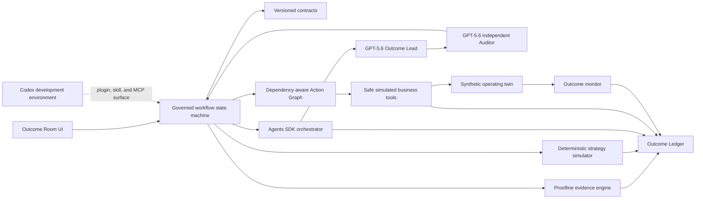

# PACT architecture

## Product boundary

The Build Week implementation proves one complete operating loop for one synthetic manufacturing outcome:

`signal -> proof -> impact -> strategy -> challenge -> approval -> execution -> observation -> learning`

The implemented boundary is intentionally narrow. The contracts and tool interfaces are designed so other KPIs and real enterprise adapters can be added later without representing those future capabilities as complete.

## Runtime design

## Layers

### Contracts

The Metric Contract defines OTIF, its grain, controls, and invariants. The Outcome Contract defines the objective, target, constraints, authority, and permitted action classes. JSON Schemas define agent and tool boundaries.

### Deterministic domain engine

Pure TypeScript functions reproduce the KPI, rank contributors, calculate impacts, construct strategies, enforce constraints, order action dependencies, authorize tool calls, advance time, and compare projected with observed results. A fixed scenario version always yields the same values.

### Governed workflow

The client follows an explicit stage machine. Later stages cannot appear complete until required evidence, challenge, approval, and predecessor states exist. State is locally persisted so a refresh does not invent progress.

### Intelligence boundary

GPT-5.6 is used through the OpenAI Agents SDK. An explicit manager-style orchestrator runs the Outcome Lead and then gives the Independent Auditor an immutable packet containing the same evidence plus the typed plan. Each agent has a distinct instruction boundary, Zod output type, SDK output guardrail, response ID, and trace ID. The agents have no business tools and cannot hand off authority. Their output is advisory until validated against deterministic calculations and hard constraints. The prepared demo remains executable without external credentials through a clearly labeled offline fixture.

### Agent topology

The implementation deliberately uses two reasoning agents, not a swarm:

1. **PACT Outcome Lead** synthesizes one evidence-cited, six-team recovery recommendation. Its output guardrail requires cross-team coverage and rejects claims that the plan was already approved or executed.
2. **Independent PACT Outcome Auditor** receives a frozen audit packet. Its output guardrail requires the verdict to agree with the severity of its findings.
3. **Executive decision owner** is not an agent. The human reviews both outputs together and remains the only authority that can release the deterministic action graph.

Linked SDK traces group both reasoning stages into the governed workflow. A checkpoint preserves a valid Outcome Lead result before the audit begins. Automatic API retries are disabled, and a durable pre-call cost ledger enforces a configurable project budget that cannot exceed $5.

### Tool boundary

Material actions are executed by named simulated tools, never by direct UI mutation. Each request includes a correlation ID, approved plan ID, action ID, and parameters. Tools validate approval, dependencies, policy, and schemas before returning a ledger event.

### Outcome Ledger

The append-only-in-session ledger correlates contracts, evidence, simulations, decisions, approvals, actions, observations, and closeout. Exported JSON is traceable and content-hashed; PACT does not claim formal immutability or certification.

## Flagship data flow

1. Reproduce 84.3% baseline and 72.4% current OTIF from aggregate counts.
2. Verify data completeness, grain, definition, and historical reconciliation.
3. Rank evidence-backed contributors: Atlas 41%, Wilmington 27%, Carrier Delta 19%, other 13%.
4. Calculate 318 at-risk orders and 42 affected strategic customers.
5. Compare margin, speed, and balanced recovery strategies.
6. Challenge the balanced plan and surface material dissent.
7. Record a synthetic human approval.
8. Execute finance, supplier, production, carrier, customer-draft, and work-item tools in dependency order.
9. Advance through Days 3, 7, 14, and 21.
10. Compare the simulated 82.2% projection with observed synthetic outcomes of 81.5% and 82.1%.

## Trust boundaries

- Calculations and policy checks are deterministic.
- Model-produced explanations are schema-validated and evidence-cited.
- Approval is performed by a human demonstration identity.
- The Auditor can block but cannot approve or execute.
- Business tools are synthetic, least-authority, and locally scoped.
- External customer communication is draft-only.

## Replaceable adapters

The synthetic tools implement stable interfaces for finance authorization, supplier commitment, production resequencing, carrier reservation, customer drafting, and work-item creation. Future ERP, procurement, logistics, CRM, or collaboration adapters would implement the same contracts behind enterprise authentication and controls.
